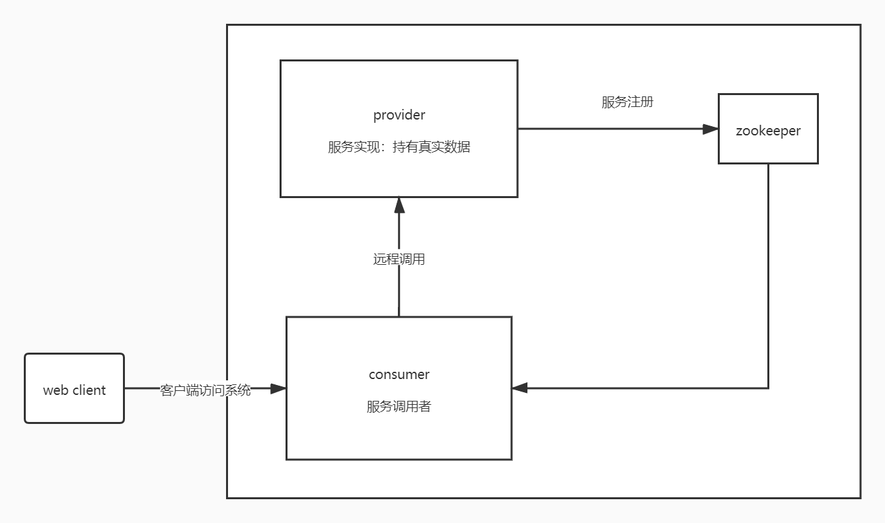

# dubbo-test
在这个项目中简单的做一个dubbo项目搭建的模板

# 项目结构

# PS
  mail：此模块为远程调用的基础模块，其中定义了了基础的数据结构和调用方法接口。
  provider：此模块以一个基础的maven工程来实现了dubbo的服务提供者。配置方式为xml，使用本机zookeeper作为服务注册中心。需要依赖基础模块mail。
  consumer：此模块以一个基础的maven工程来实现了dubbo的服务调用者。配置方式为xml。需要依赖基础模块mail。
  dubbo-spring-boot-provider：此模块将spring-boot与dubbo集成来实现了一个服务的提供者，使用本机zookeeper作为服务注册中心。其中支持多种配置方式。
  dubbo-spring-boot-consumer：从模块将spring-boot与dubbo集成来实现了一个服务的调用者。其中为了减少模块数量也提供了服务的提供者。实现负载均衡的测试。并且集成了Hystrix以实现服务熔断。